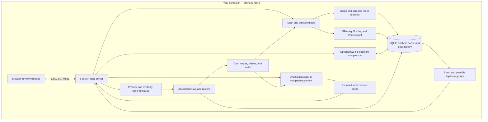

# Vault Purge v1.2

Local image, video, and audio duplicate review with cached analysis and reversible moves. Python 3.11+, FastAPI, SQLite, Pillow, ImageHash, and OpenCV.

## Run

From this project directory:

```powershell
uv sync
uv run vault-purge serve
```

Open http://127.0.0.1:47831. This is the new default port in v1.2; update older bookmarks using port 8000. If you are using the existing Windows virtual environment without `uv` on PATH:

```powershell
.venv\Scripts\python.exe -m vault_purge serve
```

Alternatively install with `python -m pip install -e .` and run `python -m vault_purge serve`.

Use **Browse…** to select a local directory, then **Scan folder**. The folder dialog lists directories on the server computer; it does not upload files. You can also type a path, including a network-share path accessible to your account.

### CLI

```powershell
uv run vault-purge scan --path "D:\Photos" --max-workers 2
uv run vault-purge scan --path "D:\Photos" --serve
uv run vault-purge scan --path "D:\Photos" --classify-only
uv run vault-purge scan --path "D:\Photos" --force
uv run vault-purge report --output groups.json
uv run vault-purge serve --port 47832 --database .vault_purge/cache.sqlite3
```

Scans include subfolders by default; use `--no-recursive` for just the chosen folder. The CLI never moves files. Metadata-only scans (the CLI flag remains `--classify-only`) skip file hashes, fingerprints, integrity decoding, and blur analysis; a later full scan fills those measurements in.

## How it works

Normal operation is offline. The browser connects to the local server, and analysis, fingerprints, previews, and review history stay on your computer. Internet access is needed to download development dependencies and prepare the media-tool bundle; the bundled Windows app needs no startup downloads. Network-share folders still require access to their host.



The server binds to loopback only. Use `serve --port <number>` if 47831 is already occupied. Scanning never moves files; moves require a separate review and confirmation.

## What is supported

| Feature | Images | Videos | Audio |
| --- | --- | --- | --- |
| Exact-copy candidates | MD5 file hash | MD5 file hash | MD5 file hash |
| Possible duplicates | 64-bit pHash | pHashes of frames at 10%, 50%, and 90%, plus similar duration | Local Chromaprint fingerprints and similar duration |
| Orientation | EXIF-aware dimensions | Decoder-rotated frame dimensions | Not applicable |
| Blur estimate | Laplacian variance | Median score of sampled frames | Not applicable |
| Preview | Resized image | Thumbnail and playback; on-demand compatible preview | Playback; on-demand compatible preview |
| Manual move and restore | Yes | Yes | Yes |

Image extensions: JPG/JPEG, PNG, WebP, BMP, TIFF/TIF, GIF. Animated images use the first frame. Video extensions: MP4, MOV, MKV, AVI, WebM, M4V, MPG/MPEG, WMV. Actual video decoding depends on codec support in OpenCV's FFmpeg backend. Unsupported or damaged files are shown under **Unreadable**.

Possible video duplicates must have all three corresponding frame hashes within the similarity threshold. Durations must differ by at most the larger of 0.25 seconds or 1% of the shorter duration. This is a review heuristic, not proof of whole-clip identity: audio, unsampled scenes, subtitles, edits, and alternate tracks are not compared. Trimmed, cropped, or rearranged clips can be missed. Unknown-duration clips are eligible only for exact matching. Duration is estimated from decoder frame count and frame rate and can be inaccurate for variable-frame-rate media. Use **Play preview** to open video playback. Use **Compare two clips** for separate, experimental segment evidence.

Blur scores are advisory. Smooth artwork, shallow depth of field, intentional motion blur, or low texture may score poorly. Scores use grayscale analysis capped at 1024 pixels; native small files are not enlarged. Video blur labels explicitly describe samples, not every frame.

## Review and organize

The app opens with an empty view on every page load. It does not automatically scan an inserted drive or reopen previous results. Choose a directory and click **Scan folder**; the results and counts then include only files encountered in that scan, including when scanning without subfolders.

**Scan history** lists saved scans with their directory, time, completion state, and counts. **Show last scan** reopens the newest entry explicitly. **Clear view** hides the current results without removing history. **Clear scan history** removes all saved scan entries and their file membership after confirmation; it never touches media files, cached analysis, or move/restore records. Subsequent scans still benefit from the cache. History cannot be cleared while a scan or file operation is running in this server.

History saves scan membership and summary counts, not immutable copies of files or measurements. Opening an older scan shows those files' latest cached details and current move status. Reconnect removable drives to load their thumbnails or act on their files. Caches from older versions appear as imported history with an unknown original scan date.

- **Duplicate groups:** exact and possible matches remain separate. Every possible-group member matches its anchor; members need not match each other. A file can appear in both exact and possible groups.
- **All media:** filter by images/videos/audio, scanned folder, orientation, status, and potential blur.
- **Sort:** path A–Z, size, modification date, lowest sharpness, or longest duration. Group size sorting uses total group bytes; group date sorting uses the newest/oldest member. Sorting happens before pagination.
- **Suggested keep:** images/videos use resolution, file size, oldest modification time, then path. Audio uses oldest modification time, then path; this is a stable suggestion, not an audio-quality ranking. The suggestion never selects files or initiates a move.
- **Show in folder:** click on any active/suspect media card or move history record to reveal and highlight the file in your system file manager (Explorer / Finder / Linux).
- **Grid / List view:** toggle between grid view and compact detailed list view with smaller thumbnails.
- Select files manually, choose **Preview moves**, and review the source and destination list.
- **Preview only** is on by default. To move files, turn it off in Review settings, build a fresh preview, and confirm. Restores also require it to be off.

Relative backup paths are resolved inside each file's scanned root and preserve its relative folder structure. Existing destination files are never overwritten. Files are copied to an exclusively created destination, verified, then removed from the original location. This also works across drives but temporarily requires room for the copy.

Operations are journaled before file changes. **Move history** offers restore for completed moves. Restore refuses to overwrite an occupied original path or use a modified backup. Interrupted/failed transfers may retain both paths and appear as **attention**; inspect those paths manually. Startup reconciles unambiguous completed transfers, but does not erase partial copies. Avoid editing media or running multiple app instances/CLI scans against the same database during moves.

## Corruption review

Full image scans verify structure and decode every frame, including animated/multipage images. Cards show **Image integrity checks passed** when those checks finish; this does not guarantee detection of every defect. Orientation-only image scans show **Integrity not checked**. Videos show **Video samples decoded**, not a whole-file guarantee: damage outside sampled frames or in audio may go undetected.

In **All media → Media status → Possible corruption**, rejected files show the decoder failure and a **Prepare quarantine** action. This adds the file to your selection and opens the move preview for all selected files, suggesting `_corrupt_review`. Review the selection, build the preview, and explicitly confirm with preview-only mode disabled to move files aside for later deletion review. The app never permanently deletes them. Unsupported formats/codecs can look like corruption; try another player or a known-good backup before deciding the file is unusable.

Access failures are labelled separately and are not suggested for quarantine. Restoring a suspect file preserves its error flag. Repair/replacement followed by a successful scan clears it. Existing caches start with unchecked integrity and are re-analyzed on the next scan.

## Cache and performance

SQLite is stored in `.vault_purge/cache.sqlite3` relative to the working directory. Unchanged records reuse measurements when path, size, nanosecond modification/change timestamps, and analysis version match. Repeat scans still walk directories and read metadata. `--force` re-analyzes files if external software changed content without changing tracked metadata.

Schema v5 adds audio metadata, fingerprints, and versioned segment caches without deleting records or move history. Upgrading the analysis version causes a one-time re-analysis of existing files. Keep a backup of the database before upgrading between releases.

File hashing uses threads; image/video analysis uses a process pool with bounded batches (default: up to four workers). Thumbnails use a bounded in-memory cache. Near matching uses a Hamming-distance index; worst-case grouping can still be expensive for highly similar collections. Directory walking is incremental, but record/group metadata is held in memory. No 50,000-file performance claim has been benchmarked.

## Scan feedback, audio, and playback

Scans show an animated activity strip, elapsed time, and found/analyzed/cached/error counters. Cache-only scans also report progress. The strip is indeterminate because directory discovery is incremental. Reduced-motion preferences disable its animation. Results preparation is a separate state; no percentage or completion estimate is invented.

Audio extensions: MP3, FLAC, WAV, M4A, OGG, Opus, AAC, WMA, AIFF/AIF. Full audio scans decode every audio stream for integrity checking, within a two-hour processing timeout. Metadata includes the first audio stream's codec, sample rate, channels, and duration. Decoder errors are review evidence, not proof of corruption; explicit unsupported-codec and access errors are distinguished. Fingerprinting failure does not invalidate a successful integrity check. Audio supports the existing exact-copy, quarantine-review, move, and restore workflows.

Possible music matches use local Chromaprint algorithm 2 fingerprints of up to the first 120 seconds of the first audio stream. Candidates require duration agreement within the larger of two seconds or 2%, at least 80 fingerprint items with sufficient variation, and at least 90% bit agreement over a small timing-offset search. Each member matches its anchor. The displayed agreement is **not a probability**. Short, silent, repetitive, alternate, and heavily edited recordings can be missed or misidentified. Thresholds have synthetic-media coverage; broader real-music calibration remains pending. Listen before deciding what to keep. No online music-identification service is used.

**Play preview** serves available audio/video originals with range requests for seeking. If the browser cannot play the original, click **Prepare compatible preview**. Video previews use H.264/AAC MP4, audio uses AAC M4A. Preview conversion runs on demand with one worker, a bounded queue, a processing timeout, and a 1 GiB disk cache beside the database. Oversized previews are rejected. Cached previews are keyed by source path, timestamps, size, media type, and conversion version. Old files are evicted when space is needed. Originals remain untouched. The source must still match the scan; changed files require another scan. Moved files must be restored before playback.

## Experimental shared-segment comparison

Select exactly two available audio/video files and click **Compare two clips**. This compares up to the first **30 minutes** per file and caches versioned measurements. A scan or move cannot run concurrently with this comparison.

Visual evidence uses frame hashes every two seconds, excludes low-texture frames, and requires sustained varied matches. Audio evidence uses local Chromaprint sequences with an offset search. Matching offsets can identify trims and reordered portions. The dialog reports approximate matching ranges and coverage relative to each full file duration, separately for audio and visuals. Shared music alone never creates a video duplicate group. Results do not select or move files.

This is an experimental review aid: only the strongest 32 candidate offsets and up to 20 ranges per evidence type are retained. Short cuts, sampling misalignment, crops, speed changes, repeated scenes, silence, and content beyond the limit can be missed. A lack of matches does not prove the files differ throughout. Reported ranges are approximate, especially near cuts and audio fingerprint boundaries.

## Bundled Windows build

The Windows executable includes pinned FFmpeg/ffprobe 9.0.2 and Chromaprint fpcalc 1.6.1, so end users do not install them separately. For development or a fresh build:

```powershell
.venv\Scripts\python.exe tools/fetch_media_tools.py
.venv\Scripts\python.exe build_exe.py
```

The preparation script downloads upstream Windows x64 archives, verifies pinned SHA-256 hashes, and retains license notices. The build verifies executable hashes before packaging. The resulting `dist/vault-purge.exe` runs without a separate media-tool installation. Downloads never happen at application startup. Developer runs search the project bundle first, then PATH; explicit `VAULT_PURGE_FFMPEG`, `VAULT_PURGE_FFPROBE`, and `VAULT_PURGE_FPCALC` paths override discovery.

The tools increase executable size and one-file extraction time. See [bundled-tool notices](vault_purge/media_tools/NOTICE.md) and the retained licenses. The local development bundle is built and tested; supplying corresponding source/build materials for the exact binaries and included libraries remains a prerequisite for public redistribution.

## Settings

Environment variables or `.env`, prefixed `vault_purge_`:

| Name | Default |
| --- | --- |
| DATABASE | `.vault_purge/cache.sqlite3` |
| DRY_RUN | `true` |
| DEST_FOLDER | `_duplicates_backup` |
| SHOW_RECOMMENDATION | `true` |
| WORKERS | CPU count capped at 4 |
| PHASH_THRESHOLD | `10` (0–20; lower is stricter) |
| BLUR_THRESHOLD | `100` |
| THUMB_SIZE | `320` |

Review settings in the GUI last for the current server session. The app binds to loopback, checks host/origin, and requires a session token for mutation and folder-browsing requests. It is intended as a single-user local tool, not a publicly hosted service.

## Development and validation

Unexpected shutdowns: server launches write `diagnostics.log` beside the configured database (normally `.vault_purge/diagnostics.log`). It records startup, shutdown signals, and server exceptions, rotating at 2 MiB. A logged `SIGINT` identifies an interrupt but does not identify its sender. Worker interruptions mark the scan as interrupted and keep completed cached batches; they do not establish media corruption. Restart and scan the folder again. History entries left running by older versions are not automatically rewritten.

```powershell
uv sync
uv run pytest -q
```

Tests generate their own media and exercise decoding, EXIF orientation, blur scoring, cache hits/invalidation, corrupt and missing files, grouping, migration, sorting, directory browsing, and reversible file operations. No personal media is needed.

Code layout: `core/` scanning and analysis; `storage/` models/migrations; `api/` local routes and settings; `ui/static/` browser interface; `utils/file_ops.py` journaled transfers; `cli/` commands. `Todo.md` tracks remaining features; `CHANGELOG.md` records delivered changes.

Decoder metadata reference: [OpenCV video I/O properties](https://docs.opencv.org/4.12.0/d4/d15/group__videoio__flags__base.html).
